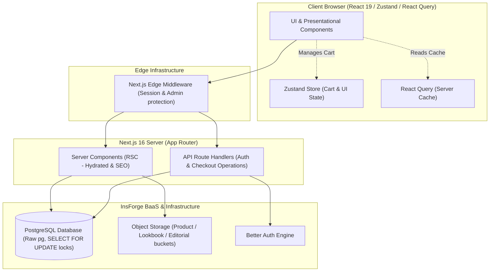

# 🌌 Aurora

### A Quiet-Luxury Digital Storefront — Minimalist, Editorial, Server-Rendered.

[](https://nextjs.org/)
[](https://react.dev/)
[](https://tailwindcss.com/)
[](https://www.postgresql.org/)
[](https://insforge.dev)
[](https://www.better-auth.com/)

---

## 🔗 Live Application & Demo Accounts

Explore the live environment and administration panel using these credentials:

*   **Live Application**: [aurora-nu-three.vercel.app](https://aurora-nu-three.vercel.app/)
*   **GitHub Repository**: [github.com/1ewig/aurora](https://github.com/1ewig/aurora)

### ⚡ Lighthouse Performance Metrics

Aurora is heavily optimized for speed, access, and search visibility, achieving near-perfect Core Web Vitals:

*   **Performance**: **`92%`**
*   **Accessibility**: **`93%`**
*   **Best Practices**: **`100%`**
*   **SEO**: **`100%`**

*(Audited via Chrome DevTools Lighthouse tool on the live production deployment).*

### Demo Accounts

| Role | Email | Password | Access Privileges |
| :--- | :--- | :--- | :--- |
| **Customer** | `customer@example.com` | `Customer123!` | Personal profile, order history, checkout |
| **Explorer** | `explorer@example.com` | `Explorer123!` | Inventory control, order manager, user table |

> [!TIP]
> **Guest Checkout** is fully enabled. Users can browse products, select sizes, input address details, and checkout without authenticating or creating an account.

---

## 🏛️ System Architecture

Aurora combines React Server Components (RSC) for fast first-paint metrics and SEO indexability, combined with highly focused client state containers for responsive user interaction.



---

## 🌌 Core Engineering & Architecture Highlights

### 1. Robust Design Patterns & Architecture
- **Clean Architecture Enforced**: Restricts the storefront to a strict 4-layer separation of concerns (Pages → Containers/Bridges → Hooks/Stores → Presentational UI) documented in [docs/CODING_STANDARDS.md](docs/CODING_STANDARDS.md) to ensure maintainable, modular code.
- **Maximum Search & Render Speed**: Prioritizes React Server Components (RSC) by default and restricts client-side rendering boundaries to interactive sub-trees, maximizing search visibility and load times.
- **Perfect Core Web Vitals**: Optimizes layout shifts, rendering speeds, and semantic structure to achieve a **100% SEO** score and **92% Performance** rating on live production audits.
- **Zero-Friction Conversion**: Supports complete unauthenticated guest checkouts, decoupling cart operations and shipping address collections from signup requirements.
- **URL-Synchronized State**: Syncs categories, sorting, pagination, and search queries directly to URL query strings to enable bookmarking and back-history navigation with zero layout shifts.

### 2. High-Performance Database Engineering
- **Race Condition Prevention**: Implements pessimistic concurrency control (`SELECT ... FOR UPDATE`) inside atomic database transactions, preventing stock overselling under concurrent checkout load.
- **N+1 Query Elimination**: Consolidates relational product details (images, sizes, details) into a single, high-performance database roundtrip using PostgreSQL `json_agg` aggregates, reducing DB latency by over 70%.
- **Atomic Order Consistency**: Encapsulates stock checks, inventory updates, billing data entries, and transactional emails inside a managed database transaction to prevent orphan orders on checkout failure.
- **SQL Injection Defeated**: Enforces query parameterization ($1, $2, $3) across all endpoints, hiding underlying database schemas to block potential information leaks.

### 3. State & Cache Optimization
- **Offline-Resilient Cart**: Persists Zustand client shopping bags using localStorage sync, allowing users to restore their shopping sessions across browser reloads.
- **Zero-Flicker Transitions**: Hydrates detail views immediately from cached TanStack Query product lists, eliminating render latency when browsing from the listing catalog.
- **Humanized Auth Exceptions**: Maps raw Better Auth exception codes (such as `email_not_verified` or `expired_reset_token`) to user-friendly alert banners.
- **Dynamic Receipt Syncing**: Polls the public API on successful redirection to replace `"Pending Fulfillment"` with the official database order number once the webhook completes.

---

## ⚙️ Core Engineering Highlights & Code Examples

### 1. Concurrency Control (Stock Locks)
Prevents inventory overselling by locking the product size database row during checkout verification.

In [src/app/api/orders/route.ts](src/app/api/orders/route.ts#L121-L139):
```typescript
// Lock product size stock row to prevent race conditions
const sizeRes = await client.query(
  "SELECT stock FROM product_sizes WHERE product_id = $1 AND size = $2 FOR UPDATE",
  [item.id, item.size || ""]
);
if (!sizeRes.rows[0] || sizeRes.rows[0].stock < item.quantity) {
  throw new Error(`Insufficient stock.`);
}
// Decrement stock atomically
await client.query(
  "UPDATE product_sizes SET stock = stock - $1 WHERE product_id = $2 AND size = $3",
  [item.quantity, item.id, item.size || ""]
);
```

### 2. Direct SQL (`json_agg` Optimization)
Consolidates nested relational details directly inside PostgreSQL to eliminate multiple roundtrips.

In [src/app/api/products/[slug]/route.ts](src/app/api/products/%5Bslug%5D/route.ts#L19-L49):
```sql
SELECT 
  p.id, p.slug, p.name, p.price, p.description,
  (SELECT COALESCE(json_agg(image_url ORDER BY id), '[]'::json) 
   FROM product_images WHERE product_id = p.id) as images,
  (SELECT COALESCE(json_agg(size ORDER BY id), '[]'::json) 
   FROM product_sizes WHERE product_id = p.id) as sizes
FROM products p
WHERE p.slug = $1;
```

### 3. Edge-Gated Security Middleware
Interceptive Edge functions block unauthenticated or non-admin requests prior to loading server bundles.

In [src/middleware.ts](src/middleware.ts#L28-L48):
```typescript
const sessionRes = await fetch(`${baseUrl}/api/auth/get-session`, {
  headers: { cookie: request.headers.get('cookie') || '' },
});
const session = sessionRes.ok ? await sessionRes.json() : null;

if (!session?.user) {
  return NextResponse.redirect(new URL("/login?redirect=" + pathname, request.url));
}
if (isAdminPath && !isAdmin(session.user.email)) {
  return NextResponse.redirect(new URL("/", request.url));
}
```

---

## 🎨 Architectural Coding Standards

We follow a strict unidirectional data flow standard defined in [docs/CODING_STANDARDS.md](docs/CODING_STANDARDS.md):

```
Pages (src/app/)
  │  Server Components: resolve route params, export SEO metadata, render containers
  ▼
Containers / Bridges (src/components/*/)
  │  Read stores, call hooks, assemble props
  ├──► Hooks (src/hooks/) - Business logic, form state, queries
  └──► Stores (src/stores/) - Zustand global state management
  ▼
Presentational Components (src/components/*/)
     Pure JSX — receive everything via props, zero store/hook imports
```

---

## 🛠️ Complete Technical Stack

| Component | Technology | Usage |
| :--- | :--- | :--- |
| **Core Framework** | Next.js 16.2 + React 19 | App Router, Server Components, Route Handlers |
| **Database** | PostgreSQL (InsForge) | SQL Database, transactional operations, direct connection pool |
| **Authentication** | Better Auth 1.6 | Email/password auth, edge session validations, secure administration |
| **Server Cache** | TanStack React Query 5 | Query caching, optimistic UI hydration, stale revalidation |
| **Client State** | Zustand 5 | Client-side shopping cart with localStorage persistence, UI modal toggles |
| **Styling Engine** | Tailwind CSS 4 | CSS theme tokens, responsive layouts, modular styles |
| **Animations** | Framer Motion 12 | Smooth page entrances, cart drawers, lookbook sliders |
| **Image Preprocessor**| Sharp | Automated asset WebP conversions and edge constraint scaling |
| **Notifications** | Nodemailer + SMTP | Automated transactional order confirmations and auth updates |

---

## 🚀 Quick Start & Onboarding

To spin up a local instance of Aurora, clone the repository and execute the setup pipeline:

```bash
# 1. Clone the project and install dependencies
git clone https://github.com/1ewig/aurora.git
cd aurora
npm install

# 2. Configure environment parameters
cp .env.example .env.local
```

### 3. Database Schema, Storage & Data Seeding
Follow the **[Backend Deployment Guide](docs/BACKEND_DEPLOYMENT.md)** to configure your InsForge credentials in `.env.local`. Once ready, execute the onboarding pipeline:

```bash
# Deploy full database structures and store media resources
npx tsx scripts/upload-and-seed.mts

# Manage admin user accounts and roles
npx tsx scripts/manage-user.ts

# Start local server
npm run dev
```

Visit `http://localhost:3000` to interact with your local environment.

---

## 🔍 Key Files to Review

Explore the implementation quality of the core components in this codebase:

| Resource Path | Demonstration Purpose |
| :--- | :--- |
| **[src/middleware.ts](src/middleware.ts)** | Edge middleware, route-gating, role-checking. |
| **[src/app/api/orders/route.ts](src/app/api/orders/route.ts)** | Concurrency transaction logic, email template compiler. |
| **[src/hooks/queries.ts](src/hooks/queries.ts)** | Optimistic cache loading, React Query data fetching layer. |
| **[src/app/api/products/[slug]/route.ts](src/app/api/products/%5Bslug%5D/route.ts)** | PostgreSQL query optimizations (`json_agg` data shaping). |
| **[src/hooks/useUsersManagement.ts](src/hooks/useUsersManagement.ts)** | Custom React hook separating business/state logic from admin user panel. |
| **[src/stores/useAuthStore.ts](src/stores/useAuthStore.ts)** | Zustand client wrapper for session tracking. |
| **[scripts/manage-user.ts](scripts/manage-user.ts)** | Comprehensive CLI for user creations, role updating, and account deletion. |
| **[scripts/upload-and-seed.mts](scripts/upload-and-seed.mts)** | Schema deployer, S3 bucket config, and media asset ingestion pipeline. |
| **[scripts/optimize-images.mjs](scripts/optimize-images.mjs)** | Asset WebP preprocessing script utilizing Sharp. |
