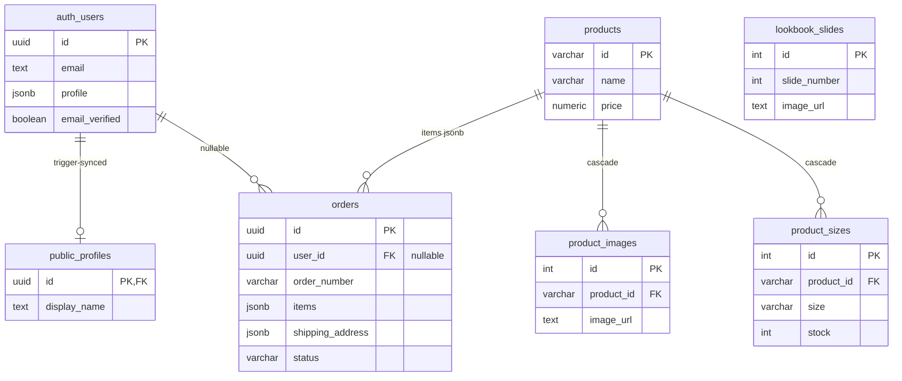

# Aurora

A quiet-luxury fashion e-commerce platform — live at **[aurora-nu-three.vercel.app](https://aurora-nu-three.vercel.app/)**.

Built with **Next.js 15** and **PostgreSQL** to demonstrate production-ready full-stack development: secure authentication, database architecture, server-side state management, and developer tooling.

**TypeScript** · **Tailwind CSS 4** · **Framer Motion** · **Zustand** · **TanStack Query** · **InsForge**

---

## Overview

| | |
|---|---|
| **Catalog** | Product listing with category filters, detail pages, size/stock selectors, and image galleries aggregated via `json_agg()` single-query joins |
| **Checkout** | Authenticated and guest checkout with server-side pricing recalculation — client-supplied totals are ignored to prevent price manipulation |
| **Auth** | Email/password sign-up with OTP verification, password reset flow, SSR cookie-based sessions, and middleware-protected routes |
| **Content** | Database-driven lookbook carousel and editorial story pages — slides and articles managed via PostgreSQL, served through REST endpoints |
| **Account** | User profiles with display name editing, order history with detail modals, and automatic profile sync via DB triggers |
| **Media** | Three isolated storage buckets (product, lookbook, editorial) with Sharp WebP optimization pipeline |

---

## What This Project Shows

### Security Architecture

- **Middleware-gated protected routes** — `/profile` and subpaths are guarded by `updateSession` from `@insforge/sdk/ssr`. Unauthenticated requests are redirected to `/login?redirect=<path>`. Tokens are refreshed transparently by the middleware on every matching request.
- **SSR cookie-based authentication** — Server routes (`/api/auth/sign-in`, `/api/auth/sign-up`, `/api/auth/verify-email`, `/api/auth/sign-out`) use `setAuthCookies` for httpOnly access and refresh tokens. Client-side code calls these server routes rather than the SDK directly, keeping token handling server-side.
- **Rate-limited user enumeration** — `POST /api/auth/check-user` implements an in-memory sliding-window rate limiter (10 requests per minute per IP) with `429 Too Many Requests` responses.
- **Server-side pricing enforcement** — `POST /api/orders` recalculates subtotal, shipping (free above $500), tax (8%), and total from the items array only. Client-supplied pricing is ignored entirely.
- **Row-Level Security** — `public.profiles` enforces RLS: public read, individual insert/update scoped to `auth.uid()`. Storage buckets have per-bucket RLS policies.
- **Parameterized queries** — All database operations use `pg` prepared statements, preventing SQL injection.

### Data & State Design

- **PostgreSQL with `json_agg()`** — Product detail pages fetch catalog data, images, sizes, and details in a single query using `json_agg()` to avoid N+1.
- **DB trigger-synced profiles** — On `auth.users.profile` update, a trigger syncs `display_name` to `public.profiles` with a `COALESCE` fallback: `displayName` → `name` → `nickname`.
- **Zustand for client state** — Auth sessions, cart contents, and UI state live in Zustand stores. The cart persists to `localStorage` via Zustand's `persist` middleware.
- **TanStack Query for server state** — Products, lookbook slides, and editorial content are cached by TanStack Query. Navigating between the catalog and a product page shows cached data instantly (0ms perceived load), fetching only extended details in the background.
- **In-memory rate limiter** — A `Map<string, { count, timestamp }>` with periodic cleanup enforces per-IP limits without external dependencies.

### Guest Checkout with Analytics

- Guest orders insert into `orders` with `user_id = NULL` — the FK constraint `REFERENCES auth.users(id) ON DELETE SET NULL` permits null values.
- Admin analytics can distinguish guest orders: `SELECT ... FROM orders WHERE user_id IS NULL`.
- Guest email is captured in `shipping_address` JSONB for order confirmation.
- Order numbers (`AUR-{year}-{6-digit}`) are generated server-side for both guests and authenticated users.

### Developer Tooling

- **Automated catalog sync** — `scripts/update-catalog.mts` processes new product images through Sharp (WebP conversion, resize), uploads to the correct InsForge Storage bucket, and upserts product data to PostgreSQL without affecting users, orders, or existing products.
- **Multi-bucket storage** — Three buckets (`product-media`, `lookbook-media`, `editorial-media`) with per-bucket policies and standardized upload utilities.
- **Database-driven content** — Lookbook slides and editorial pages are stored in PostgreSQL and served through API endpoints, enabling content updates without redeployment.

---

## Architecture

The codebase follows a 4-layer separation of concerns:

```
Route Layer       → Server components, metadata, layout wrappers
Container Layer   → Client components wiring state to UI (bridges)
Logic Layer       → Zustand stores, custom hooks, TanStack Query
Presentation      → Pure presentational components — props in, JSX out, no side effects
```

Route handlers (`src/app/api/`) use `createServerInsforge` from `@insforge/sdk/ssr` for authenticated database access. Client components use `createBrowserClient` from the same SDK for browser-side operations.

---

## Database Schema



Key `auth` trigger (runs on `auth.users.profile` update):

```sql
display_name = COALESCE(
  new.profile->>'displayName',
  new.profile->>'name',
  new.profile->>'nickname',
  display_name
);
```

---

## API Surface

| Method | Path | Auth | Description |
|--------|------|------|-------------|
| GET | `/api/products` | No | Product listing |
| GET | `/api/products/[slug]` | No | Product detail with images, sizes, details |
| GET | `/api/lookbook` | No | Lookbook slides |
| GET | `/api/editorial` | No | Editorial content |
| POST | `/api/auth/sign-in` | No | Email/password sign-in |
| POST | `/api/auth/sign-up` | No | Account creation |
| POST | `/api/auth/sign-out` | No | Session destruction |
| POST | `/api/auth/verify-email` | No | OTP email verification |
| POST | `/api/auth/check-user` | No | Existence + verification check (rate-limited) |
| GET | `/api/auth/refresh` | Yes | Token refresh |
| GET | `/api/orders` | Yes | Current user's order history |
| POST | `/api/orders` | No | Create order (guest or authenticated) |

---

## Code Highlights

### Middleware protected route guard

```typescript
const protectedPaths = ["/profile"];

export async function middleware(request: NextRequest) {
  if (!isProtectedPath(request.nextUrl.pathname)) return NextResponse.next();

  const response = NextResponse.next({ request });
  await updateSession({ requestCookies: request.cookies, responseCookies: response.cookies });

  const accessToken =
    response.cookies.get("insforge_access_token")?.value ||
    request.cookies.get("insforge_access_token")?.value;

  if (!accessToken) {
    const loginUrl = new URL("/login", request.url);
    loginUrl.searchParams.set("redirect", request.nextUrl.pathname);
    return NextResponse.redirect(loginUrl);
  }
  return response;
}
```

### Rate limiter sliding window

```typescript
const rateLimit = new Map<string, { count: number; timestamp: number }>();
const WINDOW_MS = 60_000;
const MAX_REQUESTS = 10;

function isRateLimited(ip: string): boolean {
  const now = Date.now();
  const entry = rateLimit.get(ip);
  if (!entry || now - entry.timestamp > WINDOW_MS) {
    rateLimit.set(ip, { count: 1, timestamp: now });
    return false;
  }
  if (entry.count >= MAX_REQUESTS) return true;
  entry.count++;
  return false;
}
```

### Server-side order pricing

```typescript
// Client-supplied subtotal/shipping/tax/total are never read.
// Everything is recalculated from the items array.
const subtotal = items.reduce(
  (sum, item) => sum + item.price * item.quantity, 0
);
const shipping = subtotal > 500 || subtotal === 0 ? 0 : 25;
const tax = Math.round(subtotal * 0.08 * 100) / 100;
const total = subtotal + shipping + tax;
```

---

## Tech Stack

| Layer | Technology |
|-------|-----------|
| **Framework** | Next.js 15.5.19 (App Router, SSR) |
| **Language** | TypeScript 5.9, React 19 |
| **Database** | PostgreSQL (InsForge managed) |
| **BaaS** | InsForge (auth, storage, DB) |
| **State** | Zustand + TanStack Query v5 |
| **Styling** | Tailwind CSS 4 |
| **Animation** | Framer Motion 12 |
| **Media** | Sharp (WebP pipeline) |
| **Deployment** | Vercel |

---

## Getting Started

```bash
git clone https://github.com/1ewig/aurora
cd aurora
npm install
npm run dev
```

Configure InsForge credentials in `.env.local`:

```env
NEXT_PUBLIC_INSFORGE_URL=https://<project>.insforge.app
NEXT_PUBLIC_INSFORGE_ANON_KEY=<your-anon-key>
```

See `BACKEND_DEPLOYMENT.md` for full setup instructions.

---

<p align="center">
  Built by <a href="https://github.com/1ewig">Moshu</a>
</p>
